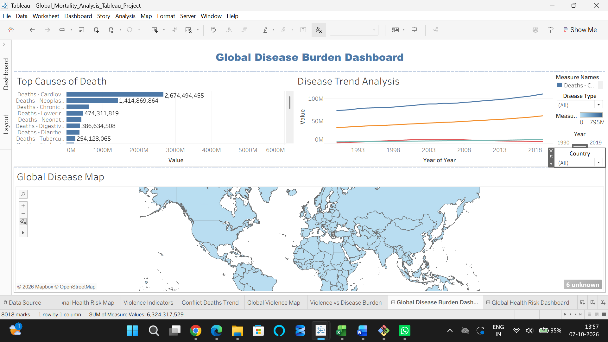
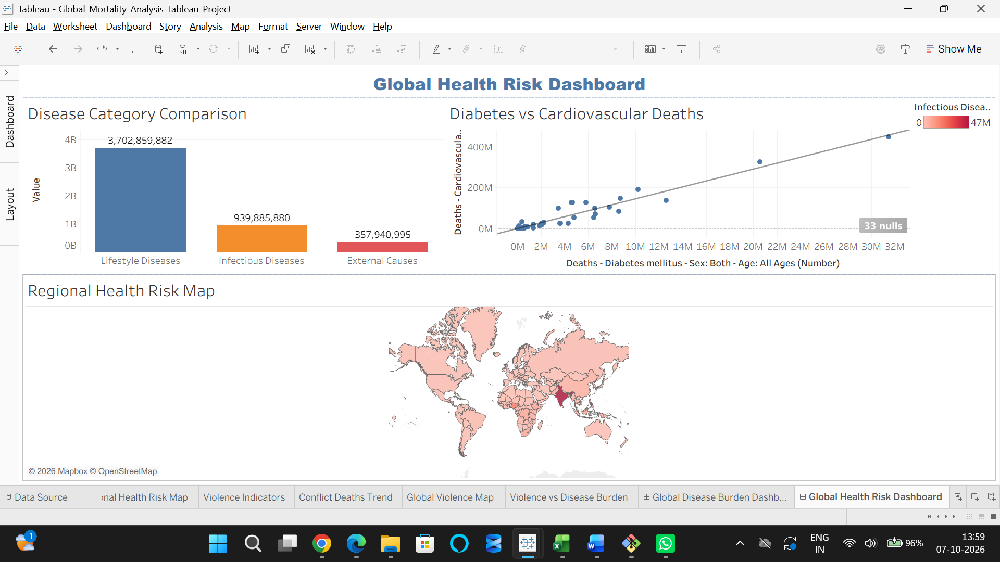
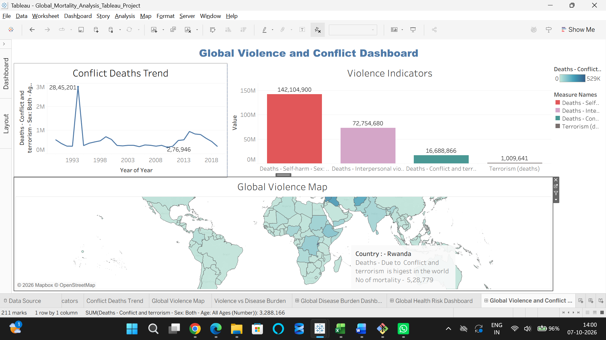

# Global Mortality Analysis — Tableau Business Analyst Project

## 📊 Project Overview

This project analyzes global mortality patterns using Tableau to identify major causes of death, health risks, infectious disease burden, and violence and conflict-related mortality.

The analysis is organized into three major areas:

- Global Disease Burden
- Global Health Risk
- Violence, Conflict & Social Risk

## 🎯 Business Questions

The project answers the following key business questions:

1. What are the top causes of death globally?
2. Which countries face higher infectious disease burden?
3. Are lifestyle diseases increasing over time?
4. Which countries experience the highest conflict-related mortality?
5. Which regions face multiple health risks simultaneously?

## 🛠️ Tools & Technologies

- Tableau
- Excel
- Data Visualization
- Calculated Fields
- Filters & Parameters
- Dashboard Actions
- Trend Analysis
- Geographic Mapping
- Scatter Plot Analysis

## 📌 Dashboards

### 1. Global Disease Burden Dashboard

Analyzes major causes of death, disease trends over time, and geographic disease burden.

**Key visualizations:**
- Top Causes of Death
- Disease Trend Analysis
- Global Disease Map

### 2. Global Health Risk Dashboard

Compares major health-risk categories and examines relationships between diabetes and cardiovascular mortality.

**Key visualizations:**
- Disease Category Comparison
- Diabetes vs Cardiovascular Deaths
- Regional Health Risk Map

### 3. Global Violence and Conflict Dashboard

Analyzes violence indicators, conflict-related mortality, and changes in conflict deaths over time.

**Key visualizations:**
- Violence Indicators
- Global Violence Map
- Conflict Deaths Trend

## 🖼️ Dashboard Preview

### Global Disease Burden Dashboard

### Global Health Risk Dashboard

### Global Violence and Conflict Dashboard

### 1. Global Disease Burden Dashboard

Analyzes major causes of death, disease trends over time, and geographic disease burden.

**Key visualizations:**
- Top Causes of Death
- Disease Trend Analysis
- Global Disease Map

### 2. Global Health Risk Dashboard

Compares major health-risk categories and examines relationships between diabetes and cardiovascular mortality.

**Key visualizations:**
- Disease Category Comparison
- Diabetes vs Cardiovascular Deaths
- Regional Health Risk Map

### 3. Global Violence and Conflict Dashboard

Analyzes violence indicators, conflict-related mortality, and changes in conflict deaths over time.

**Key visualizations:**
- Violence Indicators
- Global Violence Map
- Conflict Deaths Trend

## 🔍 Key Insights

- Lifestyle diseases represent the largest mortality category in the analysis.
- Infectious diseases remain a significant health burden, with India standing out in the analysis.
- Cardiovascular diseases are among the leading causes of death globally.
- Rwanda records the highest conflict-related mortality in the Global Violence Map.
- The Conflict Deaths Trend shows a major spike in 1994.
- Several countries, including India, China, Russia, and Brazil, show comparatively high levels of both disease and violence mortality.

## 📈 Key Category Totals

| Category | Total Deaths |
|---|---:|
| Lifestyle Diseases | 3,702,859,882 |
| Infectious Diseases | 939,885,880 |
| External Causes | 357,940,995 |

## 📂 Project Files

- `Global_Mortality_Analysis_Tableau_Project.twbx` — Tableau packaged workbook
- `Global_Mortality_Analysis_Insight_Report.pdf` — Insight report
- `Screenshots/` — Dashboard previews

## 💡 Skills Demonstrated

- Data visualization
- Business analysis
- Tableau dashboard development
- Data interpretation
- Geographic analysis
- Trend analysis
- Correlation analysis
- Dashboard design
- Business insight communication
